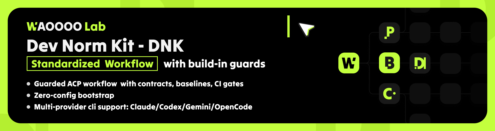
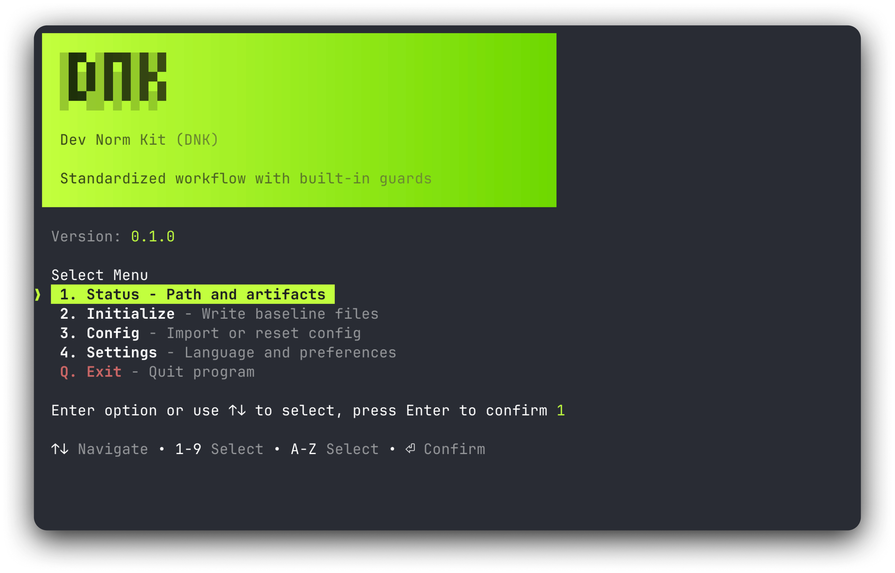
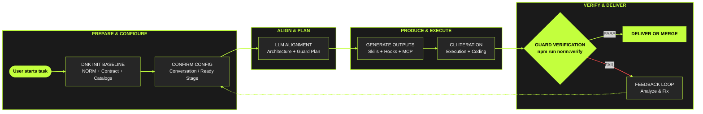

<div align="center">
  <h1>Dev Norm Kit - DNK</h1>
  <p>Vibe coding in norm: move fast in creative flow while every local ACP run stays standardized, guarded, and review-ready.</p>
  <p>
    <a href="https://github.com/daniellee2015/dev-norm-kit/tags"></a>
    <a href="https://www.npmjs.com/search?q=dev-norm-kit"></a>
    <a href="https://github.com/daniellee2015/dev-norm-kit"></a>
    <a href="https://github.com/daniellee2015/dev-norm-kit"></a>
  </p>
  <p><a href="./README.md"><strong>English</strong></a> · <a href="./README.zh-CN.md"><strong>简体中文</strong></a></p>

<br>
  <p></p>
</div>





## Why DNK

DNK is a local ACP standardization kit.
It connects one baseline contract to provider-native files so teams can keep creative coding speed without losing reproducibility, guard coverage, or cross-provider consistency.

<br>

## Integrated User + DNK Workflow



<br>

This is the practical flow model:

1. Start from one standardized baseline, not ad-hoc local files.
2. Confirm project configuration in conversation/ready before heavy execution.
3. Align with LLM on architecture, baseline, and guard strategy before generation.
4. Generate outputs and execute work in iterative loops.
5. End every loop with guard verification; on failure, go back to config and plan.

<br>

## Terminal Recommendation

For the best DNK CLI and TUI experience, we recommend:
**Primary: Ghostty**.

| Logo | Terminal | Link | Why Recommended |
| --- | --- | --- | --- |
|  | **Ghostty (Primary)** | [ghostty.org](https://ghostty.org/) | Excellent color fidelity and smooth interactive redraw behavior |
|  | WezTerm | [wezterm.org](https://wezterm.org/) | Strong ANSI/Unicode rendering and reliable cross-platform behavior |
|  | iTerm2 | [iterm2.com](https://iterm2.com/) | Stable macOS terminal with robust ANSI support for CLI UI |

These terminals provide stronger ANSI rendering (colors, gradients, box drawing, interactive cursor updates).
Basic system terminals can still run DNK, but visual rendering may degrade in some views.

<br>

## Current Stage and Scope

DNK is currently in a **lite bootstrap stage**.
It works best when used to initialize or normalize **new projects** first, then apply provider sync and guard verification.

| Area | Status now | Notes | Next |
| --- | --- | --- | --- |
| New project bootstrap (`dnk init`) | Supported (recommended) | Best-fit path today; baseline and provider outputs are most predictable on new projects. | Keep optimizing templates and defaults |
| Existing project normalization | Partially supported | Works for many cases, but project-specific legacy structures may still require manual review. | Improve merge and conflict-safe strategies |
| Existing capability-slot detection | Not supported yet | DNK does not yet auto-detect previously wrapped/custom capability slots in existing projects. | Add slot discovery and mapping |
| In-process continuous use during active development | Not supported yet | DNK is currently command-driven (init/sync/verify), not an always-on runtime assistant during coding. | Add continuous/dev-loop integration mode |

<br>

## Install and Quick Start

### Install

```bash
npm install -D @waoooolab/dev-norm-kit
```

Or run without installation:

```bash
npx @waoooolab/dev-norm-kit init --target . --provider all_providers --install-scope project
```

### Start in 3 Steps

1. Initialize baseline and provider outputs.
2. Run guard verification.
3. Sync provider config or MCP tools only when needed.

```bash
npx dnk init --target . --provider all_providers --install-scope project
npm run norm:verify
npx dnk provider-sync --target . --provider codex_cli
npx dnk mcp-install --target . --mcp-install-dry-run
```

<br>

## Core Commands

Use only these for day-to-day work:

| Goal | Command |
| --- | --- |
| Bootstrap baseline + provider output | `npx dnk init --target . --provider all_providers --install-scope project` |
| Sync provider config only (incremental) | `npx dnk provider-sync --target . --provider codex_cli` |
| Install or preview MCP tools | `npx dnk mcp-install --target . --mcp-install-dry-run` |
| Verify baseline guards | `npm run norm:verify` |

In this monorepo you can also run:

```bash
node ops/profiles/dev-norm-kit/bin/dnk.mjs init --target /path/to/project
```

<br>

## CLI Configuration Model

### Provider Mode

- `all_providers`: generate provider-native outputs for all supported providers.
- `agnostic`: baseline only, no provider-native outputs.
- single provider (`claude_code` / `codex_cli` / `gemini_cli` / `opencode_cli`): generate only that provider path.
- auto-detect priority: `--provider` > `ACP_CLI_PROVIDER` > project markers.

### Install Scope

- `project`: write into target project.
- `user`: write into user HOME-level provider paths.
- `global`: currently normalized to `user` in this generator.
- `local`: provider-specific local behavior (for example Claude local settings).

### Overwrite and Safety

- baseline overwrite: `--force`.
- provider-native overwrite: `--provider-overwrite`.
- default behavior is append/skip where possible to reduce destructive rewrites.

### MCP Strategy

- install during init: `--install-mcp-tools`.
- limit tool set: `--mcp-tool-ids <id1,id2,...>`.
- preview only: `--mcp-install-dry-run`.

## Provider Output (High-level)

| Provider | Entrypoint file | Native output examples |
| --- | --- | --- |
| Claude Code | `CLAUDE.md` | `.mcp.json`, `.claude/commands/*`, `.claude/settings*.json` |
| Codex CLI | `AGENTS.md` | `.codex/config.toml`, `.agents/skills/*`, `.codex/skills/*` |
| Gemini CLI | `GEMINI.md` | `.gemini/settings.json`, `.gemini/commands/*` |
| OpenCode | `AGENTS.md` | `opencode.json`, `.opencode/commands/*`, `.opencode/plugins/*` |

<br>

## Typical Workflow

1. Run `dnk init` once to establish baseline and provider outputs.
2. Run `npm run norm:verify` before important merges/releases.
3. Use `dnk provider-sync` when provider-specific configs need refresh.
4. Use `dnk mcp-install` when MCP toolset changes.

<br>

## References

- Chinese README: [README.zh-CN.md](./README.zh-CN.md)
- Profile docs and registries: [docs/README.md](./docs/README.md)
- Minimal end-to-end check: `npm run test:minimal`
- Workflow and MCP scripts: `scripts/acp/*`, `scripts/guards/*`
