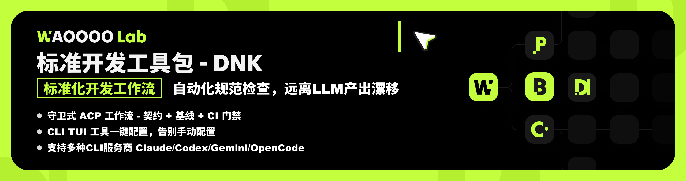
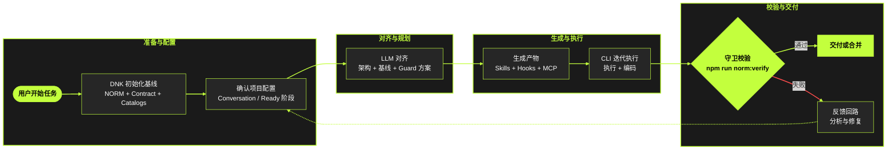

<div align="center">
  <h1>Dev Norm Kit - DNK</h1>
  <p>Vibe coding in norm：在保持创意编码速度的同时，让每一次本地 ACP 执行都标准化、可守卫、可审查。</p>
  <p>
    <a href="https://github.com/daniellee2015/dev-norm-kit/tags"></a>
    <a href="https://www.npmjs.com/search?q=dev-norm-kit"></a>
    <a href="https://github.com/daniellee2015/dev-norm-kit"></a>
    <a href="https://github.com/daniellee2015/dev-norm-kit"></a>
  </p>
  <p><a href="./README.md"><strong>English</strong></a> · <a href="./README.zh-CN.md"><strong>简体中文</strong></a></p>
<br>
  <p></p>
</div>


## 为什么需要 DNK

DNK 是一个本地 ACP 标准化工具包。
它把统一基线契约和各 Provider 原生配置连接起来，让团队在保留创意开发速度的同时，获得可复现、可守卫、跨 Provider 一致的落地结果。

<br>

## ACP 内部架构（从标准到运行）



<br>

DNK 的标准化落地链路：

1. 从一套标准基线开始，而不是各写各的本地配置。
2. 在 conversation/ready 阶段先把项目配置确认清楚。
3. 先让 LLM 对齐架构、基线、guard 方案，再生成落地。
4. 进入“生成-执行”的持续迭代过程。
5. 每一轮都以守卫校验收口；失败就回到配置与方案阶段。

<br>

## 终端工具推荐

为了获得更稳定的 DNK CLI / TUI 体验，推荐使用：
**主推：Ghostty**。

| Logo | 终端工具 | 链接 | 推荐原因 |
| --- | --- | --- | --- |
|  | **Ghostty（主推）** | [ghostty.org](https://ghostty.org/) | 颜色还原和交互刷新表现优秀 |
|  | WezTerm | [wezterm.org](https://wezterm.org/) | ANSI/Unicode 渲染稳定，跨平台一致性好 |
|  | iTerm2 | [iterm2.com](https://iterm2.com/) | macOS 下表现稳定，CLI UI 兼容性高 |

这些终端对 ANSI 渲染（颜色、渐变、边框、交互刷新）支持更好。
系统自带终端也可以运行 DNK，但部分视图可能出现显示降级。

<br>

## 当前阶段与能力边界

DNK 当前处于 **lite 引导阶段**。
它在“先初始化/规范化新项目，再执行 provider 同步和守卫校验”这条路径上效果最好。

| 能力项 | 当前状态 | 说明 | 后续计划 |
| --- | --- | --- | --- |
| 新项目初始化（`dnk init`） | 已支持（推荐） | 当前最稳定路径，基线与 Provider 产物在新项目中可预测性最高。 | 继续优化模板和默认参数 |
| 存量项目规范化 | 部分支持 | 多数场景可用，但复杂历史结构仍可能需要人工复核。 | 提升增量合并和冲突安全策略 |
| 已有“能力插槽”自动检测 | 暂不支持 | 目前不会自动识别存量项目里已封装/自定义的能力插槽并映射。 | 增加 slot 探测与映射能力 |
| 开发过程中的持续使用（边开发边运行） | 暂不支持 | 当前是命令式工具（init/sync/verify），还不是常驻式开发助手。 | 增加连续开发集成模式 |

<br>

## 安装与快速开始

### 方式 A：项目本地安装（推荐）

```bash
npm install -D @waoooolab/dev-norm-kit
npx dnk-tui
```

### 方式 B：全局安装

```bash
npm install -g @waoooolab/dev-norm-kit
dnk-tui
```

### Quick Start 流程

1. 启动 `dnk-tui`，选择语言并设置目标项目目录。
2. 在 TUI 中执行 `Initialize`，生成基线与 Provider 配置。
3. 初始化完成后，在同一项目目录启动你的 Provider CLI：
   `claude` / `codex` / `gemini` / `opencode`
4. 合并或发布前执行守卫校验：

```bash
npm run norm:verify
```

### 临时运行（不安装）

```bash
npx -y -p @waoooolab/dev-norm-kit dnk-tui
```

### 纯命令行方式（不用 TUI）

如果你更偏向纯命令：

```bash
npx dnk init --target . --provider all_providers --install-scope project
npm run norm:verify
```

<br>

## 核心命令

日常主要使用下面这些命令：

| 目标 | 命令 |
| --- | --- |
| 启动交互式 TUI | `npx dnk-tui` |
| 初始化基线与 Provider 落地 | `npx dnk init --target . --provider all_providers --install-scope project` |
| 仅同步 Provider 配置（增量） | `npx dnk provider-sync --target . --provider codex_cli` |
| 安装或预演 MCP 工具 | `npx dnk mcp-install --target . --mcp-install-dry-run` |
| 执行基线守卫校验 | `npm run norm:verify` |

在 monorepo 内也可直接运行：

```bash
node ops/profiles/dev-norm-kit/bin/dnk.mjs init --target /path/to/project
```

<br>

## CLI 配置模型

### Provider 模式

- `all_providers`：生成全部 Provider 的原生配置产物。
- `agnostic`：仅生成基线，不写 Provider 原生配置。
- 单 Provider（`claude_code` / `codex_cli` / `gemini_cli` / `opencode_cli`）：只生成该 Provider 相关产物。
- 自动识别优先级：`--provider` > `ACP_CLI_PROVIDER` > 项目标记文件。

### 安装作用域

- `project`：写入目标项目目录。
- `user`：写入用户 HOME 层 Provider 目录。
- `global`：当前生成器内归一到 `user`。
- `local`：Provider 特定本地行为（例如 Claude local settings）。

### 覆盖与安全策略

- 基线覆盖：`--force`。
- Provider 原生配置覆盖：`--provider-overwrite`。
- 默认尽量采用 append/skip，降低破坏式覆盖风险。

### MCP 策略

- 初始化阶段安装 MCP：`--install-mcp-tools`。
- 指定安装子集：`--mcp-tool-ids <id1,id2,...>`。
- 仅预演不安装：`--mcp-install-dry-run`。

## Provider 落地产物（高层）

| Provider | 入口文件 | 原生产物示例 |
| --- | --- | --- |
| Claude Code | `CLAUDE.md` | `.mcp.json`、`.claude/commands/*`、`.claude/settings*.json` |
| Codex CLI | `AGENTS.md` | `.codex/config.toml`、`.agents/skills/*`、`.codex/skills/*` |
| Gemini CLI | `GEMINI.md` | `.gemini/settings.json`、`.gemini/commands/*` |
| OpenCode | `AGENTS.md` | `opencode.json`、`.opencode/commands/*`、`.opencode/plugins/*` |

<br>

## 推荐流程

1. 先执行 `dnk init` 建立基线和 Provider 产物。
2. 在关键合并/发布前执行 `npm run norm:verify`。
3. Provider 配置需要刷新时执行 `dnk provider-sync`。
4. MCP 工具变更时执行 `dnk mcp-install`。

<br>

## 参考链接

- 英文 README：[README.md](./README.md)
- 文档与注册表：[docs/README.md](./docs/README.md)
- 最小端到端验证：`npm run test:minimal`
- 工作流与守卫脚本：`scripts/acp/*`、`scripts/guards/*`
